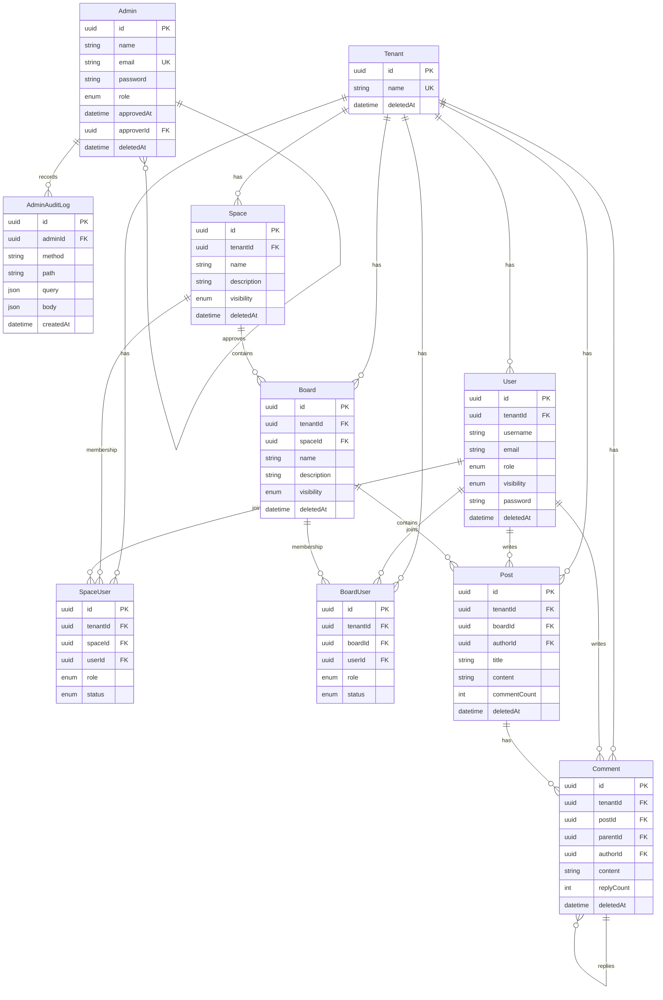

# Blommunity 데이터 모델 (ERD)

> `libs/db/schema.prisma`를 사람이 읽기 좋은 형태로 옮긴 문서입니다.
>
> **스키마가 사실의 기준입니다.** 이 문서와 스키마가 어긋나면 스키마가 옳습니다. 모델을 바꿀 때 이 문서도 같이 갱신합니다.

도메인은 다음처럼 층을 이룹니다.

```
Tenant ── Space ── Board ── Post ── Comment
  └── User (테넌트에 종속, Space/Board의 멤버)
```

운영자 영역(Admin, AdminAuditLog)은 테넌트 바깥의 전역 모델로, 위 계층과 분리되어 있습니다.

---

## 1. 전체 ERD



> 위 다이어그램은 주요 필드만 추렸습니다. 전체 필드는 아래 모델별 설명과 `libs/db/schema.prisma`를 참고하세요.

---

## 2. 공통 규칙

모든 모델이 따르는 약속입니다. 새 모델을 추가할 때도 이 규칙을 지킵니다.

- **식별자(PK)는 UUID v7** — 전 모델 `@id @default(uuid(7)) @db.Uuid`. UUID v7은 시간 순으로 정렬 가능해서, 별도 정렬 컬럼 없이도 생성 순서가 보존됩니다. PostgreSQL 컬럼 타입은 `uuid`입니다.
- **소프트 삭제는 `deletedAt`** — 삭제는 즉시 지우지 않고 `deletedAt`에 시각을 찍습니다. 조회 쿼리는 `deletedAt: null` 조건을 함께 걸어 살아 있는 레코드만 봅니다.
  - 단, **모든 모델에 `deletedAt`이 있는 것은 아닙니다.** 적용 대상은 `Admin`·`Tenant`·`User`·`Space`·`Board`·`Post`·`Comment`입니다.
  - **`SpaceUser`·`BoardUser`(멤버십 조인 테이블)와 `AdminAuditLog`에는 `deletedAt`이 없습니다.** 멤버십은 탈퇴/거절 시 레코드를 실제로 삭제(hard delete)하고, 감사 로그는 추가 전용(append-only)이라 삭제 개념이 없습니다.
- **멀티테넌시는 `tenant_id`** — 테넌트에 속하는 모든 모델(`User`/`Space`/`SpaceUser`/`Board`/`BoardUser`/`Post`/`Comment`)은 `tenantId` 컬럼을 가집니다. 모든 조회는 이 값으로 걸러져야 테넌트 간 데이터가 섞이지 않습니다. 자세한 격리 전략은 [ADR 0001](adr/0001-tenant-isolation.md)을 참고하세요.
  - `Admin`·`AdminAuditLog`는 전역 모델이라 `tenantId`가 없습니다.
- **카운터 비정규화** — 매번 `COUNT(*)`를 돌리지 않도록, 자주 읽는 집계는 컬럼으로 들고 있습니다. 현재는 `Post.commentCount`(활성 댓글 수, 모든 depth 포함)와 `Comment.replyCount`(활성 대댓글 수)만 비정규화되어 있습니다. 카운터는 작성/삭제 트랜잭션 안에서 함께 갱신되며, 주기적 정합성 재계산은 배치(X-DT-04, 📅)로 예정되어 있습니다.
- **테이블·컬럼명은 snake_case** — Prisma 모델은 PascalCase/camelCase지만, 실제 테이블/컬럼은 `@map`/`@@map`으로 snake_case에 매핑됩니다(예: `tenantId` → `tenant_id`, `Post` → `posts`).
- **타임스탬프** — 대부분의 모델이 `createdAt`(`@default(now())`)과 `updatedAt`(`@updatedAt`)을 가집니다. `AdminAuditLog`만 예외로 `createdAt`만 있습니다(불변 기록이므로).

---

## 3. Enum 정의

스키마에 정의된 enum 3종입니다. DB에는 소문자 값으로 저장됩니다(`@map`).

### Role — 역할
| 값 | 매핑 | 의미 |
|----|------|------|
| `OWNER` | `owner` | 소유자. 최고 권한 |
| `MANAGER` | `manager` | 관리자 |
| `MEMBER` | `member` | 일반 사용자 (기본값) |

> `Role`은 **운영자(Admin)와 테넌트 사용자(User/SpaceUser/BoardUser) 양쪽에서 같은 enum을 재사용**합니다. 같은 `OWNER`라도 운영자 맥락(플랫폼 전체)과 사용자 맥락(특정 공간/게시판)에서 의미하는 범위가 다릅니다. 인가 계층은 `OWNER > MANAGER > MEMBER` 순서입니다. 자세한 구분은 [glossary.md](glossary.md)를 참고하세요.

### Visibility — 공개 범위
| 값 | 매핑 | 의미 |
|----|------|------|
| `PUBLIC` | `public` | 공개. 누구나 접근 |
| `PRIVATE` | `private` | 비공개. 멤버만 |

> `Space`·`Board`의 기본값은 `PUBLIC`, `User`의 기본값은 `PRIVATE`입니다.

### MembershipStatus — 멤버십 상태
| 값 | 매핑 | 의미 |
|----|------|------|
| `PENDING` | `pending` | 초대 대기 중 |
| `ACTIVE` | `active` | 멤버 (기본값) |

> `SpaceUser`·`BoardUser`에서 사용합니다. 초대를 만들면 `PENDING`, 수락하거나 공개 공간에 직접 가입하면 `ACTIVE`가 됩니다.

### (참고) TokenType — 코드 enum
DB enum은 아니지만, 인증에서 토큰 종류를 가르는 코드 enum이 `apps/api/src/auth/auth.enums.ts`에 있습니다: `USER` / `ADMIN`. 사용자 토큰에는 `tenantId`가 담기고 운영자 토큰에는 담기지 않습니다. [threat-model.md](threat-model.md)의 권한 상승 항목과 함께 보면 좋습니다.

---

## 4. 모델별 상세

### Admin — 운영자
Blommunity 자체를 운영하는 내부 인력. **테넌트에 속하지 않는 전역 모델**입니다.

- 주요 필드: `name`, `email`(전역 `@unique`), `password`(`VarChar(60)`, bcrypt 해시), `role`, `approvedAt`(null이면 승인 대기), `approverId`(승인자, self FK)
- 관계: `approver`/`approvedAdmins`(자기 참조, `AdminApprovals`), `auditLogs`(→ AdminAuditLog)
- 제약: `email @unique`
- 비고: 가입 직후 `approvedAt`이 null인 **승인 대기(PENDING)** 상태이고, Manager 이상이 승인하면 `approvedAt`이 찍힙니다. 소프트 삭제(`deletedAt`) 대상입니다.

### AdminAuditLog — 운영자 활동 내역
모든 운영자 요청을 자동으로 남기는 **추가 전용** 기록. 부인 방지(repudiation 대응)의 핵심입니다.

- 주요 필드: `adminId`(FK), `method`, `path`(컬럼명은 `url`), `query`(Json?), `body`(Json?), `createdAt`
- 인덱스: `@@index([createdAt desc])`, `@@index([path, createdAt desc])`, `@@index([adminId, createdAt desc])` — 시간순/경로별/운영자별 조회를 빠르게 합니다.
- 비고: `updatedAt`·`deletedAt`이 없습니다(불변·삭제 없음). `body`의 password 등 민감 정보는 저장 전 마스킹됩니다(X-SC-11, ✅).

### Tenant — 테넌트(사업자)
Blommunity를 빌려 자기 커뮤니티를 운영하는 고객 하나. 모든 테넌트 스코프 데이터의 뿌리입니다.

- 주요 필드: `name`(전역 `@unique`)
- 관계: `users`, `spaces`, `boards`, `posts`, `comments`, `spaceUsers`, `boardUsers` (모두 1:N)
- 제약: `name @unique`
- 비고: 소프트 삭제 대상.

### User — 사용자(회원)
특정 테넌트에 소속된 최종 이용자. **테넌트 경계 안에서만** 유일합니다.

- 주요 필드: `tenantId`(FK), `username`, `email`(nullable), `role`(기본 MEMBER), `password`(`VarChar(60)`), `visibility`(기본 PRIVATE)
- 관계: `tenant`, `spaces`(→ SpaceUser), `boards`(→ BoardUser), `posts`, `comments`
- 제약: `@@unique([tenantId, username])`, `@@unique([tenantId, email])` — **테넌트별로** username/email이 유일합니다. 즉 서로 다른 테넌트에는 같은 username이 존재할 수 있습니다.
- 비고: 로그인은 `tenantId + username + password` 조합으로 이뤄집니다(T-AC-02).

### Space — 공간
한 테넌트가 운영하는 사이트/커뮤니티 단위. 한 테넌트가 여러 공간을 가질 수 있습니다.

- 주요 필드: `tenantId`(FK), `name`, `description`(nullable), `visibility`(기본 PUBLIC)
- 관계: `tenant`, `boards`, `users`(→ SpaceUser)
- 제약: composite unique 없음(같은 테넌트 안에서 동명의 공간이 허용됩니다)
- 비고: 소프트 삭제 대상.

### SpaceUser — 공간 멤버십
사용자가 어떤 공간에 어떤 역할/상태로 속하는지를 나타내는 조인 테이블.

- 주요 필드: `tenantId`/`spaceId`/`userId`(FK), `role`(기본 MEMBER), `status`(기본 ACTIVE)
- 관계: `space`, `user`, `tenant`
- 제약: `@@unique([spaceId, userId])`(한 공간에 한 사용자는 한 번만), `@@index([userId])`(내 멤버십 역조회용)
- 비고: **`deletedAt` 없음** — 탈퇴/거절/회수는 레코드를 실제로 삭제합니다. 상태 머신은 `(없음) → PENDING → ACTIVE → (삭제)`입니다.

### Board — 게시판
공간 안의 주제별 게시판. 공간에 종속되며, 게시판 가입에는 공간 멤버 자격이 선결 조건입니다.

- 주요 필드: `tenantId`/`spaceId`(FK), `name`, `description`(nullable), `visibility`(기본 PUBLIC)
- 관계: `tenant`, `space`, `users`(→ BoardUser), `posts`
- 제약: `@@unique([spaceId, name])` — **공간 안에서** 게시판 이름이 유일합니다(테넌트 전체가 아니라 공간 단위).
- 비고: 소프트 삭제 대상.

### BoardUser — 게시판 멤버십
사용자가 어떤 게시판에 어떤 역할/상태로 속하는지를 나타내는 조인 테이블. 구조는 `SpaceUser`와 동일합니다.

- 주요 필드: `tenantId`/`boardId`/`userId`(FK), `role`(기본 MEMBER), `status`(기본 ACTIVE)
- 관계: `board`, `user`, `tenant`
- 제약: `@@unique([boardId, userId])`, `@@index([userId])`
- 비고: **`deletedAt` 없음**(SpaceUser와 동일).

### Post — 게시물
게시판에 작성된 글.

- 주요 필드: `tenantId`/`boardId`/`authorId`(FK), `title`, `content`(Text), `commentCount`(기본 0, 비정규화 카운터)
- 관계: `tenant`, `board`, `author`(→ User), `comments`
- 인덱스: `@@index([boardId, createdAt desc])` — 게시판별 최신 글 목록 조회용
- 비고: 소프트 삭제 대상. `commentCount`는 모든 depth의 활성 댓글을 포함합니다.

### Comment — 댓글
게시물에 달린 댓글. `parentId`로 대댓글 계층을 표현합니다.

- 주요 필드: `tenantId`/`postId`/`authorId`(FK), `parentId`(nullable self FK, 대댓글이면 상위 댓글), `content`(Text), `replyCount`(기본 0, 비정규화 카운터)
- 관계: `tenant`, `post`, `author`(→ User), `parent`/`replies`(자기 참조, `comment_parent`)
- 인덱스: `@@index([postId, parentId, createdAt desc])` — 게시물의 최상위/특정 부모의 자식 댓글을 분리 조회하기 좋게 구성
- 비고: 소프트 삭제 대상. 댓글 작성 시 `Post.commentCount`와 모든 조상 `Comment.replyCount`가 트랜잭션으로 +1, 삭제 시 -1 (U-CM 카운터 자동 관리, ✅).

---

## 5. 한눈에 보는 제약 요약

| 모델 | tenant_id | deletedAt | unique 제약 | 비정규화 카운터 |
|------|:---------:|:---------:|------------|------------------|
| Admin | ✗(전역) | ✅ | `email` | — |
| AdminAuditLog | ✗(전역) | ✗ | — | — |
| Tenant | ✗(루트) | ✅ | `name` | — |
| User | ✅ | ✅ | `[tenantId, username]`, `[tenantId, email]` | — |
| Space | ✅ | ✅ | — | — |
| SpaceUser | ✅ | ✗ | `[spaceId, userId]` | — |
| Board | ✅ | ✅ | `[spaceId, name]` | — |
| BoardUser | ✅ | ✗ | `[boardId, userId]` | — |
| Post | ✅ | ✅ | — | `commentCount` |
| Comment | ✅ | ✅ | — | `replyCount` |

> 이 표가 보여주는 가장 중요한 사실: **테넌트 스코프 모델 7종은 전부 `tenant_id`를 가지지만, 그 필터를 거는 일은 지금 애플리케이션 코드의 책임**입니다. 단 한 쿼리라도 빠뜨리면 테넌트 격리가 깨집니다. 이 위험을 구조적으로 막는 결정이 [ADR 0001](adr/0001-tenant-isolation.md)입니다.

---

*ERD / 작성일: 2026-05-29 / 기준: blommunity v0.1.1 (`libs/db/schema.prisma`)*
